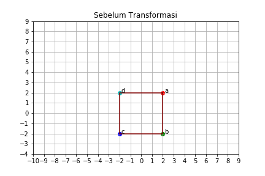
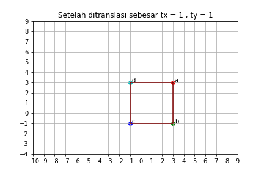
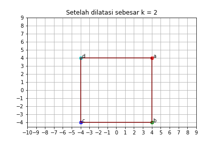
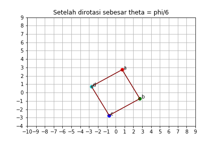
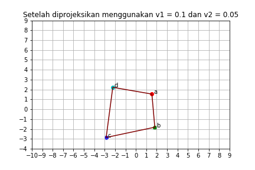

##### Bagus Nugraha #####
##### 1313617002 #####
##### Sistem Pakar Semester 112 #####
##### Assignment 1 Task 1 2D Transformations #####

laporan ini disusun untuk memenuhi *task 1 asssignment1*, diminta untuk beberapa tranformasi sederhana dalam bidang dua dimensi. saya menulis kode di jupyter notebook dengan python 3.

## Translasi ##
Translasi atau pergeseran adalah transformasi yang memindahkan titik dengan jarak dan arah tertentu. translasi dinyatakan oleh T = (tx,ty) dengan tx menyatakn jarak dan arah perpindahan secara horizontal dan ty menyatakan jarak dan arah perpindahan secara vertikal.

Jika A(x,y) di translasikan oleh T = (tx,ty), akan diperoleh bayangan A'(x',y') dengan x' = x + tx dan y' = y + ty. Atau A' = [I t]A

```
A' = [[1, 0, tx],
      [0, 1, ty]] @ A
```

Dimana I adalah matriks identitas 2x2. Dikarenakan kita menggunakan *homogeneous coordinates* yang mana A(x,y,1). Untuk dimungkinkannya transformasi menggunakan perkalian matriks maka menggunakan matriks 3x3 (didapat dari matriks 2x3 dengan menambahkan baris [0, 0, 1]). Sehingga matriksnya:

```
A' = [[1, 0, tx],
      [0, 1, ty],
      [0, 0, 1 ]] @ A
     
[x',y',1] = [[1, 0, tx],
             [0, 1, ty],
             [0, 0, 1 ]] @ [x, y, 1]
```

## Rotasi ##
Rotasi adalah transformasi yang memindahkan titik-titik dengan memutar titik-titik tersebut sejauh theta. Jika theta positif, arah putaran berlawanan dengan arah putaran jarum jam. Jika theta negatif, arah putaran searah dengan putaran jarum jam.

Jika titik A(x,y) dirotasikan sejauh theta akan diperoleh bayangan A'(x', y') dengan x' = xcos(theta) - ysin(theta) dan y' = xsin(theta) + ycos(theta)

## Rotasi + Translasi ##
Transformasi ini juga dikenal dengan *2d euclidean transformation*.

Dapat ditulis dengan x' = Rx + t dimana R:
```
R = [[cos(theta), -sin(theta)],
     [sin(theta), cos(theta)]]
```
maka x' = (xcostheta) - ysin(theta)) + tx dan y' = (xsin(theta) + ycos(theta)) + ty 
```
[x', y', 1] = [[cos, -sin, tx],
               [sin,  cos, ty], 
               [0  ,  0  , 1 ]] @ [x, y, 1]
```

## Dilatasi ##
Dilatasi adalah suatu transformasi yang mengubah ukuran (memperbesar atau memperkecil) suatu bangun geometri, tetapi tidak mengubah bentuk bangun geometri tersebut.

Jika A(x,y) didilatasikan dengan faktor skala k maka diperoleh bayangan A'(x',y') dengan x' = kx dan y' = ky.

## Affine ##
Transformasi ini kombinasi dari translasi, rotasi, dan dilatasi. Transformasi ini dapat dinyatakan sebagai x' = sRx + tx dan y' = sRy + ty atau x' = s(xcos(theta) - ysin(theta)) + tx dan y' = s(xsin(theta) + ycos(theta)) + ty (dimana s adalah faktor skala). Dari persamaan tersebut dapat kita nyatakan dalam matriks : (@ operator perkalian matriks)
```
affine_matrix = [[s.cos, -s.sin, tx],
                 [s.sin,  s.cos, ty],
                 [0    ,  0    , 1 ]]
                 
[x', y', 1] = affine_matrix @ [x, y, 1]
```

Disini saya mencoba mentransformasikan sebuah persegi dengan ukuran 4x4.
Kita tahu bahwa translasi, dilatasi, dan rotasi dimuat dalam matriks affine maka saya membuat fungsi affine2D dengan parameter matriks input, dilatasi dengan default 1, translasi dengan default (0,0) dan rotasi dengan default 0.

```python
a, b, c, d = (2, 2, 1), (2, -2, 1), (-2, -2, 1), (-2, 2, 1)
persegi = np.array([a, b, c, d])
```

```python
def affine2D (mat, dilatasi = 1., translasi = (0.,0.), rotasi = 0.):
    
    tx,ty = translasi
    s     = dilatasi
    theta = rotasi
    
    affineMat = np.array([[s*np.cos(theta), -s*np.sin(theta), tx],
                          [s*np.sin(theta), s*np.cos(theta) , ty],
                          [0              , 0               , 1 ]])
    
    baris, kolom = mat.shape
    
    hasil = np.array([])
    
    for row in mat:
        output_row = affineMat @ row
        hasil = np.append(hasil, output_row, axis = 0)
    
    return np.reshape(hasil, (baris, kolom))
```
Fungsi affine diatas memberikan hasil berupa matriks yang sudah ditransformasikan. Kemudian untuk memvisualisasikan apa yang sudah ditransformasi, dibuatlah sebuah fungsi untuk memploting sebuah matriks yaitu draw_2D.

```python
def draw_2D(mat, title='Transformasi Geometri' , filename='temp.png'):
    color_lut = 'rgbc'
    fig = plt.figure()
    ax = plt.gca()
    xs = []
    ys = []
    i = 0
    
    for row in mat:
        x, y, w = row
    
        xs.append(x)
        ys.append(y)
    
        i = int(i)
        c = color_lut[i]
        plt.scatter(x, y, color=c)
        plt.text(x + 0.15, y, f"{string.ascii_letters[i]}")
        i += 1
        
    xs.append(xs[0])
    ys.append(ys[0])
    plt.plot(xs, ys, color="maroon", linestyle='solid')
    ax.set_xticks(np.arange(-10, 10, 1))
    ax.set_yticks(np.arange(-4, 10, 1))
    plt.title(title)
    plt.grid()
    plt.savefig(filename)
    plt.show()
```






## Proyeksi ##
Proyeksi adalah transformasi linier pada vektor homogen yang diwakili oleh matriks 3×3 non-singular. matriks non-singular adalah matriksyang bisa diinvers yang mana nilai determinan dari matriks tersebut tidak sama dengan 0. kita bisa menuliskan persamaannya menjadi x' = H x

kita dapat menyatakan matriks proyeksi sebagai berikut:
```
projective transformasi
[x', y', 1]=[[a11, a12, a13],
             [a21, a22, a23],
             [a31, a32, v  ]] @ [x, y, 1]
```
Projective transformation itu punya 8 derajat kebebasan dikarenakan v = 1 atau 0. Dalam website ini [Part II: Projective Transformations in 2D](https://mc.ai/part-ii-projective-transformations-in-2d/) dijelaskan bahwa matriks H memiliki empat matriks dalam rantai matriks, projective matriks dapat kita sederhanakan menjadi:
```
projective transformasi
[wx', wy', w]=[[1,   0, 0],
               [0,   1, 0],
               [v1, v2, v]] @ [x, y, 1]
```
kenapa bisa begitu? di karenakan bagian kiri atas 4 derajat kebebasan dari komponen affine, bagian atas kanan 2 derajat kebebasan dari komponen translasi, dan menyisakan 2 derajat kebebasan yang baru yaitu v1 dan v2. karena baris ketiga juga dipakai dalam matriks projective maka hasil yang didapat tidak langsung berupa koordinat melainkan [wx,wy,w], yang mana titik tersebut bukan berada di dimensi 2 melainkan berada di dimensi 3, disinilah asal kata projeksi.

dari matriks diatas dapat kita evaluasi menjadi [wx', wy', w] = [x, y, (v1x + v2y + v)]
dengan w = v1x + v2y + v maka didapat x' = x/(v1x + v2y + v) dan y' = y/(v1x + v2y + v)

```python
def projective2D(mat,v1,v2):
    projective_matrix = np.array([[1, 0, 0],
                                  [0, 1, 0],
                                  [v1, v2, 1]])
    
    # mendapatkan ukuran matriks input
    baris, kolom = mat.shape
    
    hasil = np.array([])
    for row in mat:
        # mat_w akan menghasilkan (wx,wy,w)
        mat_w = projective_matrix @ row
        # untuk menghasilkan (x,y,1) maka dibagi dengan w, 
        # dimana w bisa kita dapat pada komponen terakhir dari mat_w
        output_row = mat_w / mat_w[2]
        hasil = np.append(hasil, output_row, axis = 0)
    
    return np.reshape(hasil, (baris, kolom))
```




